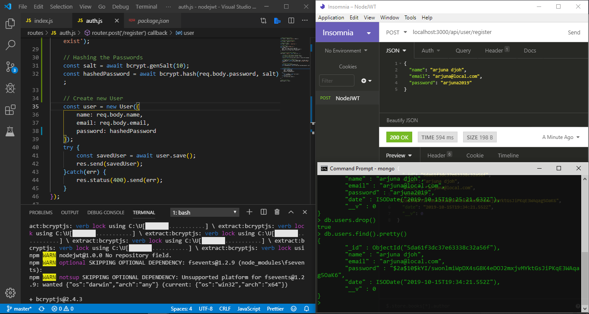
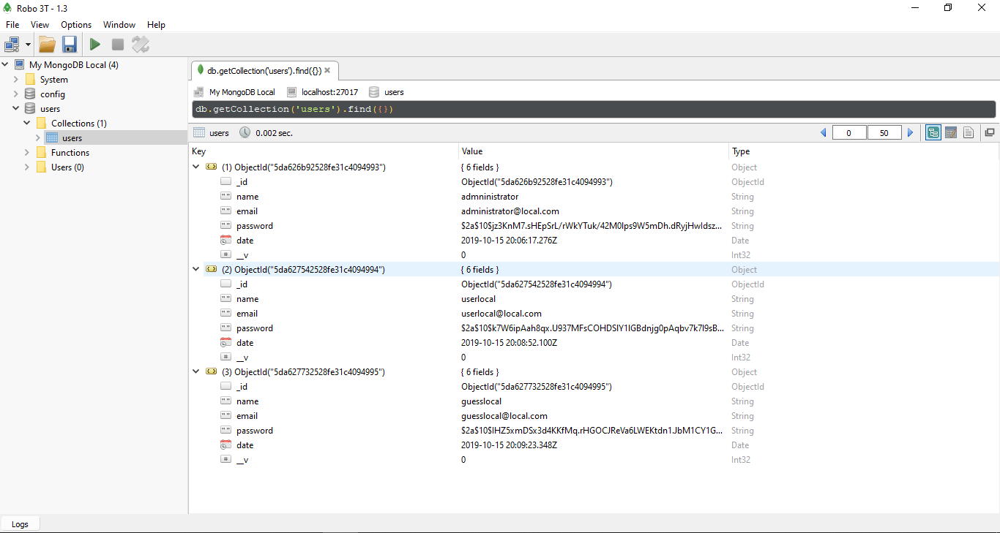

# NodeJWT

## About 

      NodeJWT is a Simple Application was developed using NodeJS and combine it using JWT.
      the reason why i made this application because i want to explore more about NodeJS, JWT, MongoDB &
      how powerfull is it.

## Installation

Feel free to download or clone this.

      - git clone https://github.com/ivandi1980/nodejwt.git
      - npm install

if you want to automatically restarting the node application when file changes in the directory 
are detectedyou then can add more dependencies like Nodemon & save it into devDependencies
      
      using NPM
      - npm install -D nodemon
      
or you can install nodemon globally on your computer so you can access it anywhere on your terminal

      - npm install nodemon -g

## Run Application

before run the application after install nodemon as a dev-dependencies into your application please change this line on your package.json file

      "scripts": {
            "start": "nodemon index.js"
      },

after you do that, then you can open the command and typing :

      npm start

### ScreenShoot

